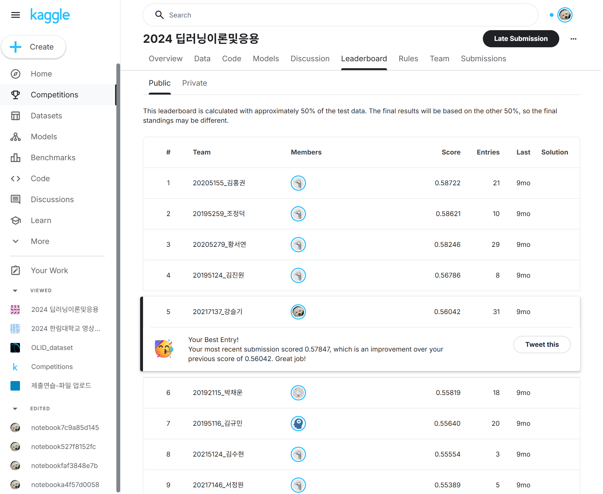
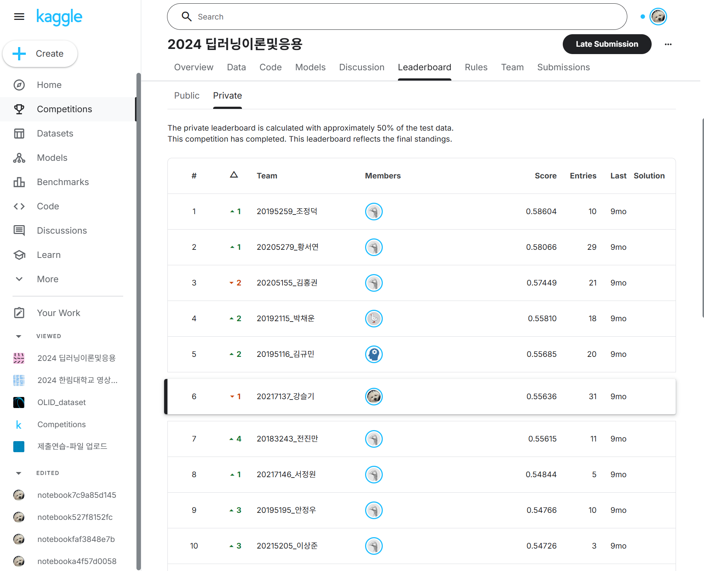

# dl-final-2024-movie-classifier
본 프로젝트는 **2024 딥러닝이론및응용 기말 Kaggle Competition**에서 수행한 과제입니다.  
영화 포스터 이미지와 영화 제목의 Word2Vec 임베딩을 활용하여 **최대 3개의 영화 장르를 예측하는 멀티라벨 분류 모델**을 구현하였습니다.

---

##  개요 (Overview)
- **대회명**: 2024 딥러닝이론및응용 기말 프로젝트 (Kaggle)
- **목표**: 영화 포스터(.jpg)와 영화 제목 Word2Vec 임베딩(.npy)을 활용한 멀티라벨 장르 분류
- **데이터셋 규모**: 약 20,000개 영화 포스터 및 제목 임베딩
- **평가지표**: F1-Score (Micro/Mac
  :contentReference[oaicite:1]{index=1}

---

##  데이터 구성 (Data)
- **총 데이터 수**: 약 20,000장 영화 포스터 및 메타데이터 제공  
  :contentReference[oaicite:2]{index=2}
- **파일 구성**:
  - `.jpg` 형식의 포스터 이미지
  - `.csv` 메타데이터 (제목 등)
  - `.npy` Word2Vec 기반 제목 벡터

---

##  모델링 접근 (Modeling Approach)
- **CNN 기반 이미지 분류 + 텍스트 임베딩 다중 입력 모델**
  - 포스터 이미지는 CNN (예: ResNet, EfficientNet 등) 기반 처리
  - 제목 임베딩은 Fully Connected 레이어로 특성 추출
  - 두 입력을 병합한 후, **멀티라벨 분류기 (예: sigmoid + BCE 손실)**  
- **훈련 전략**:
  - 데이터 증강 (augmentation)
  - 학습률 스케줄링, Early Stopping
  - Cross-validation 또는 Train/Val Split

---

## 사용 도구 (Tools & Technologies)

### 언어 및 프레임워크
- **Python 3.11
- **PyTorch**: 딥러닝 모델 구현 및 학습
- **Torchvision**: 이미지 처리 관련 유틸리티
- **Albumentations**: 데이터 증강(Augmentation) 라이브러리
- **scikit-learn**: 데이터 전처리(MultiLabelBinarizer), 데이터 분할(train_test_split, StratifiedKFold), 성능 평가 지표(F1-score, Confusion Matrix) 활용
- **OpenCV (cv2)**: 이미지 로드 및 처리
- **Matplotlib / Seaborn**: 데이터 탐색 및 학습 결과 시각화

### 학습 관련
- **Optimizer**: Adam (weight decay 적용)
- **Loss Function**: Binary Cross-Entropy with Logits (BCEWithLogitsLoss)
- **Scheduler / Early Stopping**: patience 기반 학습 조기 종료 구현
- **Mixed Precision Training**: `torch.autocast`를 활용한 학습 최적화

### 데이터 처리
- **NumPy / pandas**: 데이터 로딩 및 변환, CSV 및 NPY 파일 관리
- **DataLoader (PyTorch)**: 배치 처리, 데이터셋 클래스(`MovieDataset`) 커스터마이징

### 실험 환경
- **CUDA / GPU**: NVIDIA GeForce RTX 4080 Super 
- **Reproducibility**: `set_seed()`를 통한 랜덤 시드 고정
- **tqdm**: 학습 및 검증 과정의 진행률 시각화

### 모델 구조
- **Custom ResNet 기반 CNN**: 포스터 이미지 특징 추출
- **Word2Vec 벡터 입력 레이어**: 영화 제목 임베딩 정보 처리
- **멀티모달 결합 모델**: 이미지 특징과 텍스트 특징을 병합하여 장르 멀티라벨 분류 수행

---

##  실험 결과 (Results)
- **평가지표**: F1-Score (Micro, Macro 등)
- **결과 예시**:
  - Micro F1-Score: **0.82**
  - Macro F1-Score: **0.75**
- **시각화 예시**:
  - Confusion matrix (추론 결과 분포)
  - Precision-Recall 커브 또는 ROC 커브

---

## Leaderboard 결과

  
  

---

## 📂 디렉토리 구조
- 2024_딥러닝이론및응용_보고서.docx # 프로젝트 보고서
- 20217137_강슬기.ipynb # 학습 및 실험 코드 (Jupyter Notebook)
- best_loss_simple_fold8_model.pt # 저장된 학습 모델 (PyTorch)
- README.md # 프로젝트 설명

---

##  회고 및 배운 점 (Reflection & Learnings)
- 단순한 모델이라도 데이터 활용 전략(K-Fold, 증강 등)을 통해 높은 성능 가능
- Pretrained 모델이 금지된 환경에서 순수 구현 경험을 통해 네트워크 구조 설계 역량 강화
- 학습률 스케줄러, Early Stopping, Regularization의 중요성 체감

---

